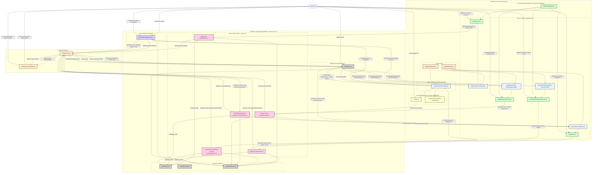

<mermaid_diagram>

```mermaid
flowchart TD
    classDef newComponent fill:#ccffcc,stroke:#333,stroke-width:2px;
    classDef modifiedComponent fill:#ffffcc,stroke:#333,stroke-width:2px;
    classDef page fill:#e6f2ff,stroke:#333,stroke-width:2px;
    classDef layout fill:#ffe6cc,stroke:#333,stroke-width:2px;
    classDef action fill:#ffcce6,stroke:#333,stroke-width:2px;
    classDef routeHandler fill:#d9ccff,stroke:#333,stroke-width:2px;
    classDef util fill:#cccccc,stroke:#333,stroke-width:2px;
    classDef external fill:#ffebcc,stroke:#333,stroke-width:2px;

    %% Użytkownik i Interakcje
    U("Użytkownik")

    subgraph "Warstwa Prezentacji (Frontend)"
        direction LR
        subgraph "Strony Publiczne (app/(public))"
            P_LOGIN["/login (Strona Logowania)"]:::page
            P_SIGNUP["/signup (Strona Rejestracji)"]:::page
            P_RESET_REQ["/reset-password (Żądanie Resetu Hasła)"]:::page
            P_UPDATE_PW["/update-password (Aktualizacja Hasła)"]:::page

            P_LOGIN --> C_LOGIN_FORM
            P_SIGNUP --> C_SIGNUP_FORM
            P_RESET_REQ --> C_RESET_REQ_FORM
            P_UPDATE_PW --> C_UPDATE_PW_FORM
        end

        subgraph "Layouty (app)"
            L_PUBLIC["(public)/layout.tsx"]:::layout
            L_DASHBOARD["dashboard/layout.tsx"]:::layout
        end

        subgraph "Komponenty Współdzielone (components/shared)"
            C_AUTH_WRAPPER["AuthFormWrapper.tsx"]:::newComponent
            C_LOGIN_FORM["LoginForm.tsx"]:::newComponent
            C_SIGNUP_FORM["SignupForm.tsx"]:::newComponent
            C_RESET_REQ_FORM["ResetPasswordRequestForm.tsx"]:::newComponent
            C_UPDATE_PW_FORM["UpdatePasswordForm.tsx"]:::newComponent
        end

        subgraph "Komponenty Layoutu (components/layout)"
            C_SIDEBAR["Sidebar.tsx"]:::modifiedComponent
            C_HEADER["Header.tsx (opcjonalna modyfikacja)"]:::modifiedComponent
        end

        subgraph "Strony Chronione (app/dashboard)"
            P_DASHBOARD["/dashboard (Panel Główny)"]:::page
        end

        %% Powiązania Layoutów ze Stronami
        L_PUBLIC --> P_LOGIN
        L_PUBLIC --> P_SIGNUP
        L_PUBLIC --> P_RESET_REQ
        L_PUBLIC --> P_UPDATE_PW
        L_DASHBOARD --> P_DASHBOARD

        %% Powiązania Wrapperów z Formularzami
        C_AUTH_WRAPPER --o C_LOGIN_FORM
        C_AUTH_WRAPPER --o C_SIGNUP_FORM
        C_AUTH_WRAPPER --o C_RESET_REQ_FORM
        C_AUTH_WRAPPER --o C_UPDATE_PW_FORM

        %% Powiązania Komponentów Layoutu z Dashboardem
        P_DASHBOARD --> C_SIDEBAR
        P_DASHBOARD --> C_HEADER

    end

    subgraph "Warstwa Logiki Aplikacji (Backend - Next.js Server)"
        direction LR
        subgraph "Server Actions (app/.../actions.ts)"
            SA_LOGIN["login() @ login/actions.ts"]:::action
            SA_SIGNUP["signup() @ signup/actions.ts"]:::action
            SA_RESET_REQ["requestPasswordReset() @ reset-password/actions.ts"]:::action
            SA_UPDATE_PW["updatePassword() @ update-password/actions.ts"]:::action
            SA_LOGOUT["logout() @ np. app/actions/auth.ts"]:::action
        end

        subgraph "Route Handlers (app/auth)"
            RH_CONFIRM["GET /auth/confirm/route.ts"]:::routeHandler
        end

        subgraph "Middleware (middleware.ts)"
            MW["middleware.ts"]:::util
        end

        subgraph "Narzędzia (lib/utils)"
            UTIL_ZOD["Walidacja Zod"]:::util
            UTIL_SUPA_CLIENT["supabase/client.ts"]:::util
            UTIL_SUPA_SERVER["supabase/server.ts"]:::util
        end
    end

    subgraph "Usługi Zewnętrzne"
        SUPABASE["Supabase Auth"]:::external
        EMAIL_SERVICE["Usługa Email (Supabase)"]:::external
    end

    %% Przepływy Danych - Rejestracja
    U -- "Wypełnia formularz rejestracji" --> C_SIGNUP_FORM
    C_SIGNUP_FORM -- "Wywołuje Server Action (email, hasło)" --> SA_SIGNUP
    SA_SIGNUP -- "Walidacja (Zod)" --> UTIL_ZOD
    SA_SIGNUP -- "supabase.auth.signUp()" --> SUPABASE
    SUPABASE -- "Wysyła email potwierdzający" --> EMAIL_SERVICE
    EMAIL_SERVICE -- "Link: /auth/confirm?type=signup" --> U
    U -- "Klika link w emailu" --> RH_CONFIRM
    RH_CONFIRM -- "supabase.auth.verifyOtp()" --> SUPABASE
    SUPABASE -- "Aktywuje użytkownika, tworzy sesję" --> MW
    RH_CONFIRM -- "Przekierowanie do /dashboard" --> P_DASHBOARD

    %% Przepływy Danych - Logowanie
    U -- "Wypełnia formularz logowania" --> C_LOGIN_FORM
    C_LOGIN_FORM -- "Wywołuje Server Action (email, hasło)" --> SA_LOGIN
    SA_LOGIN -- "Walidacja (Zod)" --> UTIL_ZOD
    SA_LOGIN -- "supabase.auth.signInWithPassword()" --> SUPABASE
    SUPABASE -- "Tworzy sesję (ciasteczka)" --> MW
    SA_LOGIN -- "Przekierowanie do /dashboard" --> P_DASHBOARD

    %% Przepływy Danych - Wylogowanie
    U -- "Klika 'Wyloguj się'" --> C_SIDEBAR
    C_SIDEBAR -- "Wywołuje Server Action" --> SA_LOGOUT
    SA_LOGOUT -- "supabase.auth.signOut()" --> SUPABASE
    SUPABASE -- "Usuwa sesję" --> MW
    SA_LOGOUT -- "Przekierowanie do /login" --> P_LOGIN

    %% Przepływy Danych - Żądanie Resetu Hasła
    U -- "Wypełnia formularz resetu hasła" --> C_RESET_REQ_FORM
    C_RESET_REQ_FORM -- "Wywołuje Server Action (email)" --> SA_RESET_REQ
    SA_RESET_REQ -- "Walidacja (Zod)" --> UTIL_ZOD
    SA_RESET_REQ -- "supabase.auth.resetPasswordForEmail()" --> SUPABASE
    SUPABASE -- "Wysyła email z linkiem" --> EMAIL_SERVICE
    EMAIL_SERVICE -- "Link: /auth/confirm?type=recovery" --> U

    %% Przepływy Danych - Aktualizacja Hasła
    U -- "Klika link w emailu resetującym" --> RH_CONFIRM
    RH_CONFIRM -- "supabase.auth.verifyOtp() (dla recovery)" --> SUPABASE
    SUPABASE -- "Umożliwia zmianę hasła (tymczasowa sesja)" --> SA_UPDATE_PW
    RH_CONFIRM -- "Przekierowanie do /update-password" --> P_UPDATE_PW
    U -- "Wypełnia formularz nowego hasła" --> C_UPDATE_PW_FORM
    C_UPDATE_PW_FORM -- "Wywołuje Server Action (nowe hasło)" --> SA_UPDATE_PW
    SA_UPDATE_PW -- "Walidacja (Zod)" --> UTIL_ZOD
    SA_UPDATE_PW -- "supabase.auth.updateUser()" --> SUPABASE
    SA_UPDATE_PW -- "Przekierowanie do /login" --> P_LOGIN

    %% Middleware
    U -- "Żądanie HTTP" --> MW
    MW -- "Odświeża/weryfikuje sesję" --> SUPABASE
    MW -- "Chroni /dashboard/*" --> P_DASHBOARD
    MW -- "Przekierowuje zalogowanych z /login, /signup" --> P_DASHBOARD
    MW -- "Przekazuje żądanie dalej (jeśli dozwolone)" --> P_LOGIN
    MW -- "Przekazuje żądanie dalej (jeśli dozwolone)" --> P_SIGNUP
    MW -- "Przekazuje żądanie dalej (jeśli dozwolone)" --> P_RESET_REQ
    MW -- "Przekazuje żądanie dalej (jeśli dozwolone)" --> P_UPDATE_PW

    %% Użycie Narzędzi Supabase
    SA_LOGIN --> UTIL_SUPA_SERVER
    SA_SIGNUP --> UTIL_SUPA_SERVER
    SA_RESET_REQ --> UTIL_SUPA_SERVER
    SA_UPDATE_PW --> UTIL_SUPA_SERVER
    SA_LOGOUT --> UTIL_SUPA_SERVER
    RH_CONFIRM --> UTIL_SUPA_SERVER
    MW --> UTIL_SUPA_SERVER
    %% Komponenty klienckie (jeśli będą potrzebować Supabase)
    %% np. C_LOGIN_FORM -.-> UTIL_SUPA_CLIENT (dla np. dynamicznego sprawdzania statusu)
```

</mermaid_diagram>
